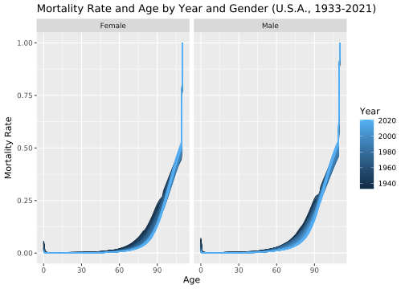
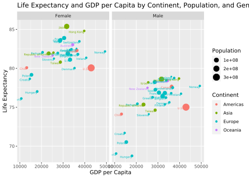
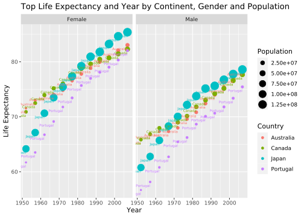

# Life Expectancy - 2021/12/31

## Get Life Tables

``` r
library(tidyverse)
library(rvest)
library(glue)
library(tools)

webpage <- "https://www.mortality.org/" %>%
  read_html %>%
  html_nodes(xpath = "/html/body/div[1]/div/div[3]/ul/li")

countries <- webpage %>%
  html_text(trim = TRUE)

codes <- webpage %>%
  html_nodes("a") %>%
  html_attr("href") %>%
  substring(23)

get_life_table <- function(country) {
  data <- codes[which(countries == country)] %>%
    map(~ {
      map_df(c("female", "male"), function(gender) {
        path_prefix <-
          ifelse(gender == "female", "fltper_1x1", "mltper_1x1")
        file_path <- glue("{path_prefix}/{.}.{path_prefix}.txt")
        read_table(file_path, skip = 2) %>%
          mutate(Country = country, Gender = gender)
      })
    }) %>%
    bind_rows
}

life_tables <- map(countries, get_life_table) %>%
  bind_rows %>%
  mutate(Age = as.numeric(str_replace(Age, "110\\+", "110"))) %>%
  filter_all(all_vars(!is.na(.)))
```

    ## Warning: 4440 parsing failures.
    ##  row col               expected actual                            file
    ## 8104  mx no trailing characters      . 'fltper_1x1/BEL.fltper_1x1.txt'
    ## 8104  qx no trailing characters      . 'fltper_1x1/BEL.fltper_1x1.txt'
    ## 8104  ax no trailing characters      . 'fltper_1x1/BEL.fltper_1x1.txt'
    ## 8104  lx no trailing characters      . 'fltper_1x1/BEL.fltper_1x1.txt'
    ## 8104  dx no trailing characters      . 'fltper_1x1/BEL.fltper_1x1.txt'
    ## .... ... ...................... ...... ...............................
    ## See problems(...) for more details.

    ## Warning: 4440 parsing failures.
    ##  row col               expected actual                            file
    ## 8104  mx no trailing characters      . 'mltper_1x1/BEL.mltper_1x1.txt'
    ## 8104  qx no trailing characters      . 'mltper_1x1/BEL.mltper_1x1.txt'
    ## 8104  ax no trailing characters      . 'mltper_1x1/BEL.mltper_1x1.txt'
    ## 8104  lx no trailing characters      . 'mltper_1x1/BEL.mltper_1x1.txt'
    ## 8104  dx no trailing characters      . 'mltper_1x1/BEL.mltper_1x1.txt'
    ## .... ... ...................... ...... ...............................
    ## See problems(...) for more details.

``` r
life_tables %>%
  glimpse
```

    ## Rows: 836,496
    ## Columns: 12
    ## $ Year    <dbl> 1921, 1921, 1921, 1921, 1921, 1921, 1921, 1921, 1921, 1921, 19…
    ## $ Age     <dbl> 0, 1, 2, 3, 4, 5, 6, 7, 8, 9, 10, 11, 12, 13, 14, 15, 16, 17, …
    ## $ mx      <dbl> 0.05999, 0.01206, 0.00578, 0.00289, 0.00325, 0.00252, 0.00248,…
    ## $ qx      <dbl> 0.05750, 0.01199, 0.00576, 0.00288, 0.00325, 0.00251, 0.00248,…
    ## $ ax      <dbl> 0.28, 0.50, 0.50, 0.50, 0.50, 0.50, 0.50, 0.50, 0.50, 0.50, 0.…
    ## $ lx      <dbl> 100000, 94250, 93120, 92583, 92316, 92016, 91785, 91557, 91391…
    ## $ dx      <dbl> 5750, 1130, 537, 267, 300, 231, 228, 166, 126, 125, 114, 105, …
    ## $ Lx      <dbl> 95857, 93685, 92851, 92450, 92166, 91900, 91671, 91474, 91328,…
    ## $ Tx      <dbl> 6317561, 6221704, 6128020, 6035168, 5942719, 5850553, 5758652,…
    ## $ ex      <dbl> 63.18, 66.01, 65.81, 65.19, 64.37, 63.58, 62.74, 61.90, 61.01,…
    ## $ Country <chr> "Australia", "Australia", "Australia", "Australia", "Australia…
    ## $ Gender  <chr> "female", "female", "female", "female", "female", "female", "f…

## Visualize Data for the U.S.A.

``` r
usa_2019 <- life_tables %>%
  filter(Country == "U.S.A.", Year == 2019)

usa_2019 %>%
  glimpse
```

    ## Rows: 222
    ## Columns: 12
    ## $ Year    <dbl> 2019, 2019, 2019, 2019, 2019, 2019, 2019, 2019, 2019, 2019, 20…
    ## $ Age     <dbl> 0, 1, 2, 3, 4, 5, 6, 7, 8, 9, 10, 11, 12, 13, 14, 15, 16, 17, …
    ## $ mx      <dbl> 0.00503, 0.00035, 0.00021, 0.00016, 0.00013, 0.00012, 0.00011,…
    ## $ qx      <dbl> 0.00500, 0.00035, 0.00021, 0.00016, 0.00013, 0.00012, 0.00011,…
    ## $ ax      <dbl> 0.14, 0.50, 0.50, 0.50, 0.50, 0.50, 0.50, 0.50, 0.50, 0.50, 0.…
    ## $ lx      <dbl> 100000, 99500, 99465, 99444, 99428, 99415, 99402, 99391, 99381…
    ## $ dx      <dbl> 500, 34, 21, 16, 13, 12, 11, 10, 9, 10, 9, 10, 12, 14, 16, 18,…
    ## $ Lx      <dbl> 99569, 99482, 99455, 99436, 99421, 99409, 99397, 99386, 99377,…
    ## $ Tx      <dbl> 8147621, 8048052, 7948570, 7849115, 7749679, 7650258, 7550849,…
    ## $ ex      <dbl> 81.48, 80.89, 79.91, 78.93, 77.94, 76.95, 75.96, 74.97, 73.98,…
    ## $ Country <chr> "U.S.A.", "U.S.A.", "U.S.A.", "U.S.A.", "U.S.A.", "U.S.A.", "U…
    ## $ Gender  <chr> "female", "female", "female", "female", "female", "female", "f…

``` r
usa <- life_tables %>%
  filter(Country == "U.S.A.")

usa %>%
  glimpse
```

    ## Rows: 19,758
    ## Columns: 12
    ## $ Year    <dbl> 1933, 1933, 1933, 1933, 1933, 1933, 1933, 1933, 1933, 1933, 19…
    ## $ Age     <dbl> 0, 1, 2, 3, 4, 5, 6, 7, 8, 9, 10, 11, 12, 13, 14, 15, 16, 17, …
    ## $ mx      <dbl> 0.05418, 0.00887, 0.00402, 0.00287, 0.00223, 0.00185, 0.00164,…
    ## $ qx      <dbl> 0.05208, 0.00883, 0.00402, 0.00287, 0.00223, 0.00185, 0.00164,…
    ## $ ax      <dbl> 0.26, 0.50, 0.50, 0.50, 0.50, 0.50, 0.50, 0.50, 0.50, 0.50, 0.…
    ## $ lx      <dbl> 100000, 94792, 93955, 93578, 93310, 93102, 92930, 92777, 92640…
    ## $ dx      <dbl> 5208, 837, 377, 268, 208, 172, 153, 136, 122, 110, 101, 98, 10…
    ## $ Lx      <dbl> 96130, 94374, 93767, 93444, 93206, 93016, 92853, 92709, 92579,…
    ## $ Tx      <dbl> 6279695, 6183565, 6089191, 5995425, 5901981, 5808775, 5715759,…
    ## $ ex      <dbl> 62.80, 65.23, 64.81, 64.07, 63.25, 62.39, 61.51, 60.61, 59.70,…
    ## $ Country <chr> "U.S.A.", "U.S.A.", "U.S.A.", "U.S.A.", "U.S.A.", "U.S.A.", "U…
    ## $ Gender  <chr> "female", "female", "female", "female", "female", "female", "f…

### Mortality Rate and Age by Gender (U.S.A., 2019)

``` r
usa_2019 %>%
  ggplot(aes(x = Age, y = qx, group = 1)) +
  geom_line(col = "blue") +
  labs(x = "Age",
       y = expression(paste("Mortality Rate")),
       title = "Mortality Rate and Age by Gender (U.S.A., 2019)") +
  facet_wrap(~ toTitleCase(Gender))
```

<!-- -->

### Mortality Rate and Age by Year and Gender (U.S.A., 1933-2021)

``` r
usa %>%
  ggplot(aes(x = Age, y = qx, color = Year)) +
  geom_line(aes(group = Year)) +
  labs(x = "Age",
       y = expression(paste("Mortality Rate")),
       title = "Mortality Rate and Age by Year and Gender (U.S.A., 1933-2021)") +
  facet_wrap(~ toTitleCase(Gender))
```

<!-- -->

### Log Mortality Rate and Age by Gender (U.S.A., 2019)

``` r
usa_2019 %>%
  ggplot(aes(x = Age, y = log(qx), group = 1)) +
  geom_line(col = "blue") +
  labs(x = "Age",
       y = expression(paste("Log Mortality Rate")),
       title = "Log Mortality Rate and Age by Gender (U.S.A., 2019)") +
  facet_wrap(~ toTitleCase(Gender))
```

<!-- -->

### Log Mortality Rate and Age by Year and Gender (U.S.A., 1933-2021)

``` r
usa = life_tables %>%
  filter(Country == "U.S.A.")

usa %>%
  ggplot(aes(x = Age, y = log(qx), color = Year)) +
  geom_line(aes(group = Year)) +
  labs(x = "Age",
       y = "Log Mortality Rate",
       title = "Log Mortality Rate and Age by Year and Gender (U.S.A., 1933-2021)") +
  facet_wrap(~ toTitleCase(Gender))
```

<!-- -->

### Survival Probability and Future Lifetime for People at Age 18 (U.S.A., 2019)

``` r
usa_2019 %>%
  filter(Age >= 18) %>%
  group_by(Gender) %>%
  mutate(survival = cumprod(1 - qx),
         k = 0:(n() - 1)) %>%
  ungroup %>% ggplot(aes(x = k, y = survival)) +
  geom_line(col = "blue") +
  labs(x = "Future Lifetime",
       y = expression("Survival Probability"),
       title = "Survival Probability and Future Lifetime for People at Age 18 (U.S.A., 2019)") +
  facet_wrap(~ toTitleCase(Gender))
```

<!-- -->

### Survival Probability and Future Lifetime by Year and Gender for People at Age 18 (U.S.A., 1933-2021)

``` r
usa %>%
  filter(Age >= 18) %>%
  group_by(Gender, Year) %>%
  mutate(survival = cumprod(1 - qx), k = 0:(n() - 1)) %>%
  ungroup %>%
  ggplot(aes(x = k, y = survival, color = Year)) +
  geom_line(aes(group = Year)) +
  labs(x = "Future Lifetime",
       y = expression("Survival Probability"),
       title = "Survival Probability and Future Lifetime by Year and Gender for People at Age 18 (U.S.A., 1933-2021)") +
  facet_wrap(~ toTitleCase(Gender))
```

<!-- -->

### Future Lifetime and Age by Gender (U.S.A., 2019)

``` r
usa_2019 %>%
  group_by(Gender) %>%
  arrange(Age) %>%
  mutate(
    px = 1 - qx,
    kpx = cumprod(px),
    future_lifetime = rev(cumsum(rev(kpx)))
  ) %>%
  ggplot(aes(x = Age, y = future_lifetime)) +
  geom_line(col = "blue") +
  labs(title = "Future Lifetime and Age by Gender (U.S.A., 2019)",
       x = "Age",
       y = "Future Lifetime") +
  theme_minimal() +
  facet_wrap(~ toTitleCase(Gender))
```

<!-- -->

### Future Lifetime and Age by Year (U.S.A., 2019)

``` r
usa %>%
  group_by(Gender, Year) %>%
  arrange(Age) %>%
  mutate(
    px = 1 - qx,
    kpx = cumprod(px),
    future_lifetime = rev(cumsum(rev(kpx)))
  ) %>%
  ungroup %>%
  ggplot(aes(x = Age, y = future_lifetime, color = Year)) +
  geom_line(aes(group = Year)) +
  labs(title = "Future Lifetime and Age by Year (U.S.A., 2019)",
       x = "Age",
       y = "Future Lifetime") +
  theme_minimal() +
  facet_wrap(~ toTitleCase(Gender))
```

<!-- -->

### Life Expectancy and Year by Gender (U.S.A.)

``` r
usa %>%
  group_by(Gender, Year) %>%
  mutate(kpx = cumprod(1 - qx),
         life_expectancy = sum(kpx)) %>%
  filter(Age == 0) %>%
  ggplot(aes(x = Year, y = life_expectancy, color = Gender)) +
  geom_line() +
  scale_color_discrete(name = "Gender", labels = c("Female", "Male")) +
  labs(x = "Year",
       y = "Life Expectancy",
       title = "Life Expectancy and Year by Gender (U.S.A.)")
```

<!-- -->

## Visualize Data

### Life Expectancy and Year by Country and Gender

``` r
life_tables %>%
  group_by(Year, Country, Gender) %>%
  mutate(kpx = cumprod(1 - qx),
         life_expectancy = sum(kpx)) %>%
  filter(Age == 0) %>%
  ungroup %>%
  ggplot(aes(x = Year, y = life_expectancy, color = Country)) +
  geom_point() +
  facet_wrap(~ toTitleCase(Gender)) +
  ggtitle("Life Expectancy and Year by Country and Gender") +
  xlab("Year") + ylab("Life Expectancy") +
  theme(axis.text.x = element_text(angle = 90, vjust = 0.5, hjust = 1))
```

<!-- -->

### Life Expectancy and Year by Gender and Country

``` r
life_tables %>%
  group_by(Gender, Year) %>%
  mutate(kpx = cumprod(1 - qx),
         life_expectancy = sum(kpx)) %>%
  filter(Age == 0) %>%
  ggplot(aes(x = Year, y = life_expectancy, color = Gender)) +
  geom_line() +
  scale_color_discrete(name = "Gender", labels = c("Female", "Male")) +
  facet_wrap(~ Country) +
  ggtitle("Life Expectancy and Year by Gender and Country") +
  xlab("Year") + ylab("Life Expectancy") +
  theme(axis.text.x = element_text(angle = 90, vjust = 0.5, hjust = 1))
```

<!-- -->

## Visualize Data with Gapminder

``` r
library(gapminder)

gapminder_modified <- gapminder %>%
  mutate(
    country = case_when(
      country == "United States" ~ "U.S.A.",
      country == "Hong Kong, China" ~ "Hong Kong",
      country == "Korea, Rep." ~ "Republic of Korea",
      country == "United Kingdom" ~ "U.K.",
      country == "Slovak Republic" ~ "Slovakia",
      TRUE ~ country
    )
  )

life_tables_gapminder = life_tables %>%
  filter(
    # Filter mutual countries of the tables
    Country %in% c(
      "Australia",
      "Austria",
      "Belgium",
      "Bulgaria",
      "Canada",
      "Chile",
      "Croatia",
      "Denmark",
      "Finland",
      "France",
      "Germany",
      "Greece",
      "Hong Kong",
      "Hungary",
      "Iceland",
      "Ireland",
      "Israel",
      "Italy",
      "Japan",
      "Netherlands",
      "New Zealand",
      "Norway",
      "Poland",
      "Portugal",
      "Republic of Korea",
      "Slovenia",
      "Spain",
      "Sweden",
      "Switzerland",
      "Taiwan",
      "U.K.",
      "U.S.A."
    )
  ) %>%
  inner_join(gapminder_modified, by = c("Year" = "year", "Country" = "country"))
```

### Life Expectancy and Year by Continent and Gender

``` r
# Calculate life expectancy for each country, gender, and year
life_expectancy_data <- life_tables_gapminder %>%
  group_by(Year, Country, Gender) %>%
  mutate(kpx = cumprod(1 - qx),
         life_expectancy = sum(kpx)) %>%
  filter(Age == 0) %>%
  ungroup

# Calculate the range of life expectancy for each country
life_expectancy_range <- life_expectancy_data %>%
  group_by(continent, Country, Gender) %>%
  summarize(life_expectancy_range = max(life_expectancy) - min(life_expectancy)) %>%
  ungroup

# Select the top 2 countries per continent based on life expectancy range
top_countries <- life_expectancy_range %>%
  group_by(continent, Gender) %>%
  top_n(2, wt = life_expectancy_range) %>%
  ungroup

# Filter the original data to include only the selected countries
filtered_data <- life_expectancy_data %>%
  semi_join(top_countries, by = c("Country", "continent", "Gender"))

# Plot the results
filtered_data %>%
  ggplot(aes(x = Year, y = life_expectancy, color = continent)) +
  geom_point() +
  facet_wrap(~ toTitleCase(Gender)) +
  geom_text(aes(label = Country),
            hjust = 1,
            vjust = 2,
            size = 2) +
  ggtitle("Life Expectancy and Year by Continent and Gender") +
  xlab("Year") + ylab("Life Expectancy") +
  labs(color = "Continent")
```

<!-- -->

### Life Expectancy and GDP per Capita by Continent, Population, and Gender in 2007

``` r
life_tables_gapminder %>%
  filter(Year == 2007) %>%
  group_by(Year, Country, Gender) %>%
  mutate(kpx = cumprod(1 - qx),
         life_expectancy = sum(kpx)) %>%
  filter(Age == 0) %>%
  ungroup %>%
  group_by(Year, Gender) %>%
  arrange(desc(life_expectancy)) %>%
  ggplot(aes(
    x = gdpPercap,
    y = life_expectancy,
    color = continent,
    size = pop
  )) +
  geom_point() +
  facet_wrap(~ toTitleCase(Gender)) +
  geom_text(aes(label = Country),
            hjust = 1,
            vjust = 1,
            size = 2) +
  ggtitle("Life Expectancy and GDP per Capita by Continent, Population, and Gender in 2007") +
  xlab("GDP per Capita") + ylab("Life Expectancy") +
  labs(color = "Continent", size = "Population")
```

<!-- -->

### Life Expectancy and GDP per Capita by Continent, Population, and Year

``` r
life_expectancy_data <- life_tables_gapminder %>%
  group_by(Year, Country) %>%
  mutate(
    Age = replace_na(Age, 110),
    kpx = cumprod(1 - qx),
    life_expectancy = sum(kpx)
  ) %>%
  filter(Age == 0) %>%
  ungroup

# Calculate the range of life expectancy for each country
life_expectancy_range <- life_expectancy_data %>%
  group_by(continent, Country) %>%
  summarize(
    life_expectancy_range = max(life_expectancy) - min(life_expectancy),
    gdpPercap_range = max(gdpPercap, na.rm = TRUE) - min(gdpPercap, na.rm = TRUE)
  ) %>%
  ungroup

# Select the top 2 countries per continent based on life expectancy range or GDP per capita range
top_countries <- life_expectancy_range %>%
  group_by(continent) %>%
  top_n(2, wt = life_expectancy_range + gdpPercap_range) %>%
  ungroup

# Filter the original data to include only the selected countries
filtered_data <- life_expectancy_data %>%
  semi_join(top_countries, by = c("Country", "continent"))

# Plot the results
filtered_data %>%
  ggplot(aes(
    x = gdpPercap,
    y = life_expectancy,
    color = continent,
    size = pop
  )) +
  geom_point() +
  facet_wrap(~ Year) +
  geom_text(aes(label = Country),
            hjust = 1,
            vjust = 1,
            size = 2) +
  ggtitle("Life Expectancy and GDP per Capita by Continent, Population, and Year") +
  xlab("GDP per Capita") + ylab("Life Expectancy") +
  labs(color = "Continent", size = "Population") +
  theme(axis.text.x = element_text(angle = 90, vjust = 0.5, hjust = 1))
```

<!-- -->
